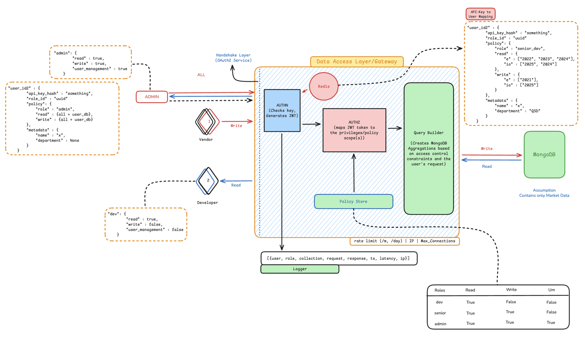

# Orb - Data Access Layer

## High Level Design



## Getting Started

### Prerequisites

*   **Docker**: Container runtime.
*   **Docker Compose**: Tool for defining and running multi-container Docker applications.

### Installation on Linux (Ubuntu/Debian)

If you are on a Linux machine (specifically Ubuntu or Debian) and do not have Docker installed, you can use the following commands. For other distributions, please refer to the official Docker documentation.

1.  **Update package index:**
    ```bash
    sudo apt-get update
    ```

2.  **Install Docker and Docker Compose:**
    ```bash
    sudo apt-get install -y docker.io docker-compose
    ```

3.  **Start and enable Docker service:**
    ```bash
    sudo systemctl start docker
    sudo systemctl enable docker
    ```

4.  **(Optional) Run Docker without sudo:**
    ```bash
    sudo usermod -aG docker $USER
    newgrp docker
    ```

### Configuration

Create a `.env` file in the root directory of the project. This file is required to configure the application's environment variables.

**`.env` Example:**

```env
USERDB_MONGO_URI=mongodb://localhost:27017/user_db
DATA_MONGO_URI=mongodb://localhost:27017/data_db
REDIS_URL=redis://localhost:6379/0
SERVER_SECRET=change_this_to_a_secure_random_string
```

### Running the Application

Once Docker is installed and the `.env` file is created, you can start the application using Docker Compose:

```bash
docker-compose up --build -d
```

## Key Components & Directory Structure

```
/
├── api/
│   ├── routers/
│   │   ├── auth.py
│   │   └── operations.py
│   └── dependencies.py
├── core/
│   ├── config.py
│   └── db.py
├── models/
│   ├── log_models.py
│   └── pydantic_models.py
├── services/
│   ├── authn.py
│   ├── exceptions.py
│   ├── log_manager.py
│   ├── operations.py
│   ├── query_router.py
│   └── utils.py
├── main.py
...
```

*   **`main.py`**: The application entrypoint. Its primary role is to initialize the FastAPI app and orchestrate the high-level request/response flow using two critical middlewares:
    *   `AuthContextMiddleware`: Decodes the JWT on incoming requests and attaches user data to `request.state`, making it efficiently available to the entire application.
    *   `LoggingMiddleware`: Wraps the entire request cycle to create a single, comprehensive log for every call, capturing success/failure, latency, payload, and detailed error info.

*   **`api/`**: The web layer.
    *   `routers/auth.py`: Contains all endpoints for authentication (`/auth/token`) and user management (`/users`).
    *   `routers/operations.py`: Contains all endpoints for generic data operations (`/data/find_one`, etc.).
    *   `dependencies.py`: Contains the `get_current_user` dependency, which now efficiently reads user data from `request.state`.

*   **`core/`**: Central configuration and database connection management.

*   **`models/`**: Pydantic data contracts.
    *   `pydantic_models.py`: Defines the data shapes for all API requests and responses. This now includes advanced validation such as `projection` fields for queries and `Literal["all", "none"]` for permissions.
    *   `log_models.py`: Provides a type-safe structure for all log entries, using a discriminated union to create distinct, validated models for `SuccessRequestLog` and `FailureRequestLog`.

*   **`services/`**: The core business logic.
    *   `log_manager.py`: A simplified service that now accepts a single, validated Pydantic log model and writes it to the database. It is only called by the `LoggingMiddleware`.
    *   `query_router.py`: The authorization hub. It now accepts the `request` object so it can access the request state and pass context (like the specific operation name) to the logging system.
    *   `operations.py`, `authn.py`, `utils.py`: These files now contain pure business logic, as all logging calls have been removed from them.

---

## The Logging System

The logging system is designed to be robust, type-safe, and centralized. It is orchestrated by the `LoggingMiddleware` and produces a single log for every API call.

*   **Context Passing**: A dictionary at `request.state.log_context` is used to pass information from the inner service layers (like the `QueryRouter`) to the outer logging middleware. This allows the final log to contain specific details like the operation name (`"find_one"`).

*   **Success vs. Failure**: The middleware uses a `try...except` block to determine the outcome of a request.
    *   A **successful** request is logged with `outcome: "Success"` and includes the `latency_ms` and `response.status_code`.
    *   A **failed** request is logged with `outcome: "Failure"` and includes a detailed `error` object containing the exception type and message.

*   **Conditional Logging**: To reduce noise, successful requests to `/api/auth/token` are **not** logged. Failed requests to this endpoint are always logged.

### Example Log Entries

**Success Log:**
```json
{
    "ts": "...",
    "action": "find_one",
    "user_id": "sir",
    "role": "admin",
    "outcome": "Success",
    "request": {
        "method": "POST",
        "path": "/api/data/find_one",
        "payload": { ... }
    },
    "response": { "status_code": 200 },
    "latency_ms": 55.8
}
```

**Failure Log:**
```json
{
    "ts": "...",
    "action": "find_one",
    "user_id": "sir",
    "role": "admin",
    "outcome": "Failure",
    "request": {
        "method": "POST",
        "path": "/api/data/find_one",
        "payload": { ... }
    },
    "error": {
        "type": "AuthorizationError",
        "detail": "User not authorized for 'read' on 'db.coll'."
    }
}
```


## Authentication

All protected endpoints require a Bearer Token obtained from the `/api/auth/token` endpoint.

```python
# Create this header to use with all subsequent requests
headers = {
    "Authorization": f"Bearer {your_access_token}"
}
```

---

## API Endpoints

### Health Check

*   **`GET /`**

    Confirms that the API is running and responsive.

    **Payload Example:**
    
    *None*

    **Request Example:**
    ```python
    import requests
    
    ORB_URL = "http://127.0.0.1:8000"
    response = requests.get(f"{ORB_URL}/")
    
    print(response.json())
    # Expected output: {'status': 'ok', 'message': 'Welcome to the Orb API!'}
    ```

### Get Access Token

*   **`POST /api/auth/token`**

    Exchanges a permanent User ID and API Key for a temporary (2-hour) JWT access token. The request must be `x-www-form-urlencoded`.

    **Payload Example:**
    ```
    # Form Data
    username: "your_user_id"
    password: "your_api_key"
    ```

    **Request Example:**
    ```python
    import requests

    ORB_URL = "http://127.0.0.1:8000"
    
    auth_data = {
        "username": "sir",
        "password": "adminpassword",
    }
    
    response = requests.post(f"{ORB_URL}/api/auth/token", data=auth_data)
    
    access_token = response.json()["access_token"]
    print(f"Access Token: {access_token}")
    ```

---

## User Management Endpoints

### Get Current User

*   **`GET /api/users/me`**

    Fetches the decoded token information for the currently authenticated user.

    **Payload Example:**

    *None*

    **Request Example:**
    ```python
    # Assumes 'headers' is already created with a valid token
    response = requests.get(f"{ORB_URL}/api/users/me", headers=headers)
    print(response.json())
    ```

### Create User

*   **`POST /api/users`**

    Creates a new user with a specified policy and permissions. Requires `user_management` permission.

    **Payload Example:**
    ```json
    {
        "user_id": "gokul_qd",
        "policy": "dev",
        "name": "Gokul",
        "department": "QD",
        "read": {
            "NSE_DATA": ["equities", "options"]
        },
        "write": "none"
    }
    ```

    **Request Example:**
    ```python
    new_user_payload = {
        "user_id": "gokul_qd",
        "policy": "dev",
        "name": "Gokul",
        "department": "QD",
        "read": {
            "NSE_DATA": ["equities", "options"]
        },
        "write": "none"
    }
    
    # Assumes 'headers' is created with an admin token
    response = requests.post(f"{ORB_URL}/api/users", headers=headers, json=new_user_payload)
    
    print(response.json())
    # On success, returns the new user's API key. Store it securely.
    ```

### Update User

*   **`PUT /api/users/{user_id}`**

    Updates an existing user's policy and/or permissions. Requires `user_management` permission.

    **Payload Example:**
    ```json
    {
        "policy": "senior_dev",
        "permissions": {
            "read": "all",
            "write": {
                "S": ["ss"]
            }
        }
    }
    ```

    **Request Example:**
    ```python
    user_to_update = "gokul_qd"
    
    update_payload = {
        "policy": "senior_dev",
        "permissions": {
            "read": "all",
            "write": {
                "S": ["ss"]
            }
        }
    }
    
    # Assumes 'headers' is created with an admin token
    response = requests.put(f"{ORB_URL}/api/users/{user_to_update}", headers=headers, json=update_payload)
    
    print(response.json())
    ```

### Delete User

*   **`DELETE /api/users/{user_id}`**

    Deletes a user from the system. Requires `user_management` permission.

    **Payload Example:**

    *None*

    **Request Example:**
    ```python
    user_to_delete = "gokul_qd"
    
    # Assumes 'headers' is created with an admin token
    response = requests.delete(f"{ORB_URL}/api/users/{user_to_delete}", headers=headers)
    
    # A successful deletion returns a 204 No Content status
    print(f"Response Status Code: {response.status_code}")
    ```

---

## Data Operation Endpoints

### Find One Document

*   **`POST /api/data/find_one`**

    Fetches the first document matching the query.

    **Payload Example:**
    ```json
    {
        "db": "NSE_DATA",
        "collection": "options",
        "query": {
            "trading_symbol": "749RJ35"
        }
    }
    ```

    **Request Example:**
    ```python
    payload = {
        "db": "NSE_DATA",
        "collection": "options",
        "query": {"trading_symbol": "749RJ35"}
    }
    
    response = requests.post(f"{ORB_URL}/api/data/find_one", headers=headers, json=payload)
    print(response.json())
    ```

### Find Documents

*   **`POST /api/data/find`**

    Fetches a list of documents matching the query. Supports server-side sorting and pagination using `limit` and `offset`.

    **Payload Example:**
    ```json
    {
        "db": "NSE_DATA",
        "collection": "equities",
        "query": {
            "series": "EQ"
        },
        "sort": [["timestamp", -1]],
        "limit": 100,
        "offset": 0
    }
    ```

    **Request Example:**
    ```python
    payload = {
        "db": "NSE_DATA",
        "collection": "equities",
        "query": {"series": "EQ"},
        "sort": [["timestamp", -1]],
        "limit": 100,
        "offset": 0
    }
    
    response = requests.post(f"{ORB_URL}/api/data/find", headers=headers, json=payload)
    print(response.json())
    ```

### Count Documents

*   **`POST /api/data/count_documents`**

    Counts the number of documents matching the query.

    **Payload Example:**
    ```json
    {
        "db": "NSE_DATA",
        "collection": "equities",
        "query": {
            "series": "EQ"
        }
    }
    ```

    **Request Example:**
    ```python
    payload = {
        "db": "NSE_DATA",
        "collection": "equities",
        "query": {"series": "EQ"}
    }
    
    response = requests.post(f"{ORB_URL}/api/data/count_documents", headers=headers, json=payload)
    print(response.json())
    # Expected output: {"count": 1234}
    ```

### Insert One Document

*   **`POST /api/data/insert_one`**

    Inserts a single document. The document to insert is placed in the `query` field.

    **Payload Example:**
    ```json
    {
        "db": "test_db",
        "collection": "test_coll",
        "query": {
            "_id": "doc123",
            "project": "orb",
            "status": "active"
        }
    }
    ```

    **Request Example:**
    ```python
    payload = {
        "db": "test_db",
        "collection": "test_coll",
        "query": {"_id": "doc123", "project": "orb", "status": "active"}
    }
    
    response = requests.post(f"{ORB_URL}/api/data/insert_one", headers=headers, json=payload)
    print(response.json())
    ```

### Update One Document

*   **`POST /api/data/update_one`**

    Updates the first document matching the `query` field, applying the operations in the `update` field.

    **Payload Example:**
    ```json
    {
        "db": "test_db",
        "collection": "test_coll",
        "query": {
            "_id": "doc123"
        },
        "update": {
            "$set": {
                "status": "archived"
            }
        }
    }
    ```

    **Request Example:**
    ```python
    payload = {
        "db": "test_db",
        "collection": "test_coll",
        "query": {"_id": "doc123"},
        "update": {"$set": {"status": "archived"}}
    }
    
    response = requests.post(f"{ORB_URL}/api/data/update_one", headers=headers, json=payload)
    print(response.json())
    ```

### Delete One Document

*   **`POST /api/data/delete_one`**

    Deletes the first document matching the query.

    **Payload Example:**
    ```json
    {
        "db": "test_db",
        "collection": "test_coll",
        "query": {
            "_id": "doc123"
        }
    }
    ```

    **Request Example:**
    ```python
    payload = {
        "db": "test_db",
        "collection": "test_coll",
        "query": {"_id": "doc123"}
    }
    
    response = requests.post(f"{ORB_URL}/api/data/delete_one", headers=headers, json=payload)
    print(response.json())
    ```
